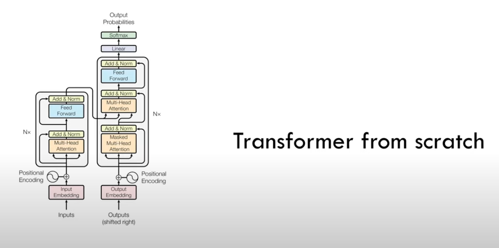

# Transformer from Scratch

## Project Overview

This project implements a Transformer model from scratch for a machine translation task. The goal is to build a functional Transformer model starting from the basic principles and gradually developing it into a full-fledged model capable of translating text between languages.

## Project Structure

```bash
.
├── config.py            # Configuration file
├── dataset.py           # Dataset processing module
├── image.png            # Project-related image
├── model.py             # Transformer model definition
├── readme.md            # Project documentation
├── run                  # Scripts or examples to run the project
├── tokenizer_en.json    # English tokenizer configuration
├── tokenizer_it.json    # Italian tokenizer configuration
├── train.py             # Model training script
└── weights              # Trained model weights
```

## Features

- **Custom Transformer Model**: An implementation of the Transformer architecture from scratch.
- **Machine Translation**: Trains and evaluates the model on a specific translation task.
- **Positional Encoding**: Implements positional encoding to enhance the model’s ability to handle sequential data.
- **Multi-Head Attention**: Utilizes multi-head attention mechanisms to capture different features.

## Usage Instructions

To train the Transformer model, run the train.py script:
```bash
python train.py
```
